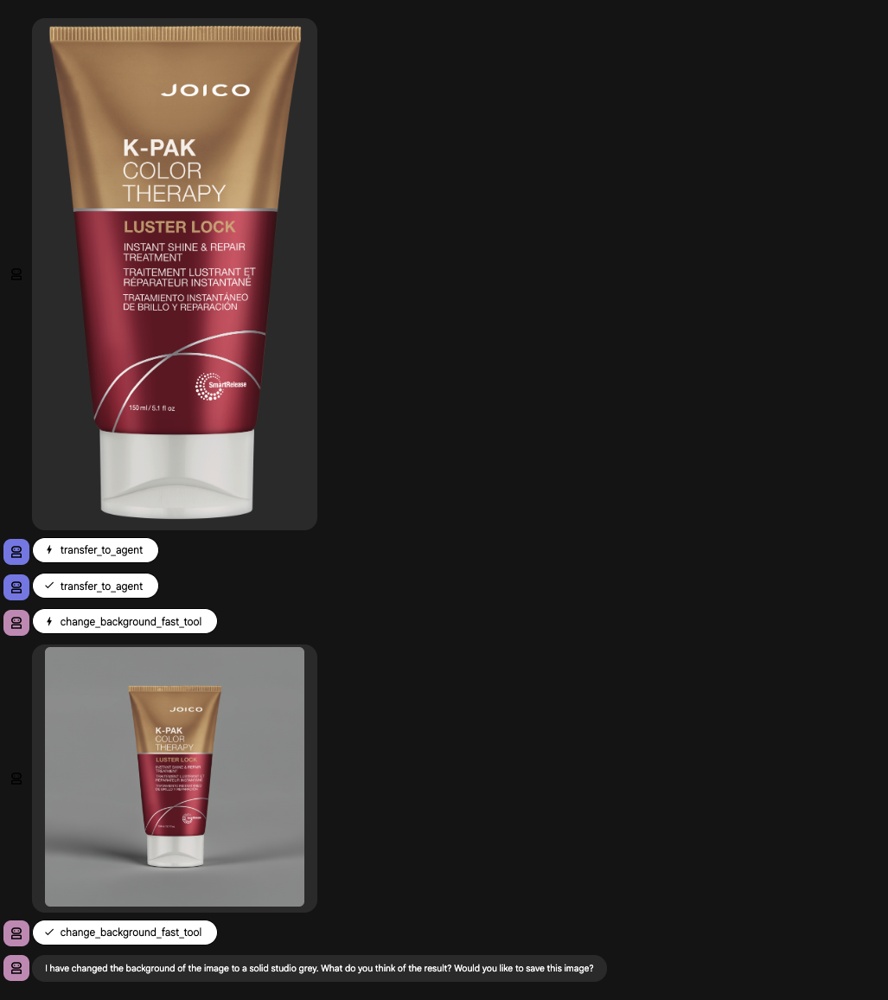
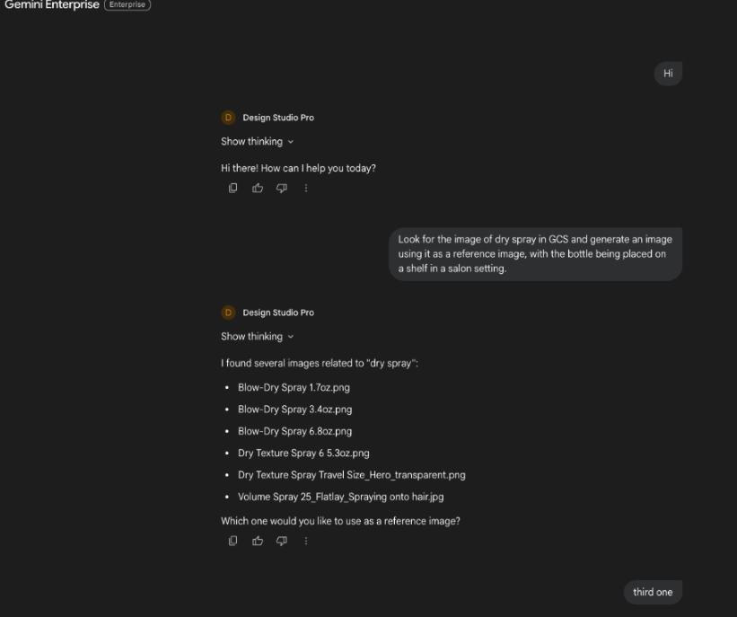
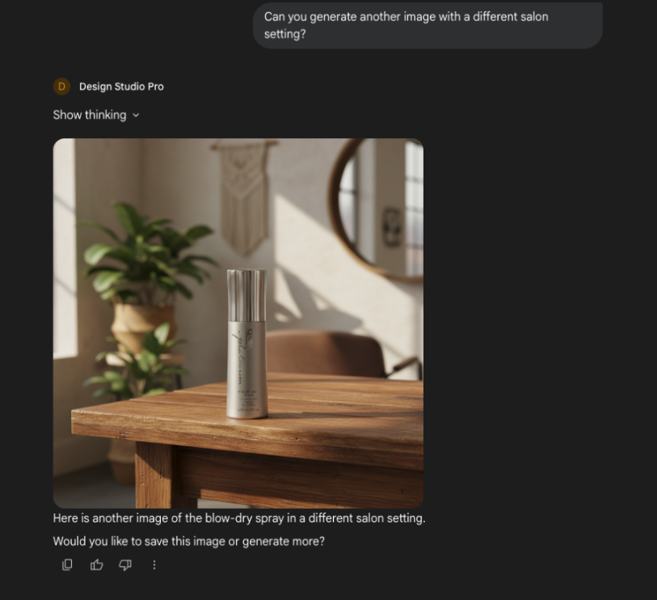
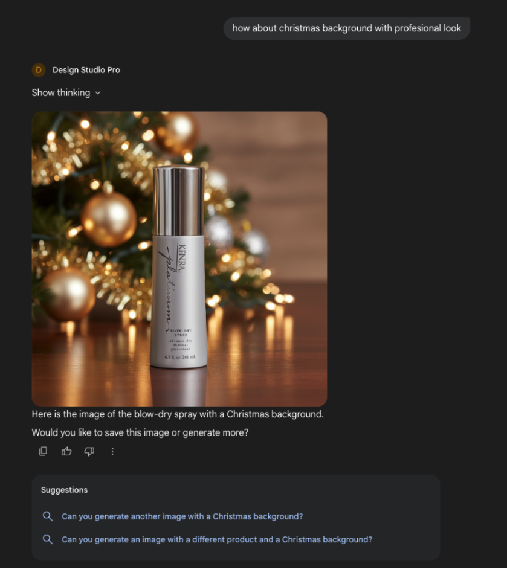

# Henkel Design Studio Agent 🎨

The Design Studio Agent is a specialized multimodal AI system designed to streamline the creation of marketing assets for Henkel's brands. It abstracts the complexity of prompt engineering and model selection, allowing marketing managers to generate high-volume, brand-compliant visual content via natural language.

The system orchestrates Gemini 2.5 Flash for reasoning and generation, and Imagen 3.0/4.0 for editing, enabling users to source products from Google Cloud Storage, generate photorealistic marketing scenes, and perform precise background editing.

## 🏗 System Architecture

The solution implements a Multi-Agent System (MAS) architecture using the Agent Development Kit (ADK). A central Root Agent evaluates user intent and routes execution to three specialized sub-agents.

1.  **Root Agent (`design_studio_agent`)**:
    *   **Model:** `gemini-2.5-flash`
    *   **Role:** The Orchestrator. Serves as the single entry point for user interaction.
    *   **Routing Logic:** Evaluates intent to route between Creation (Gen Agent), Modification (Edit Agent), or Asset Management (GCS Agent).
    *   **Capabilities:** Context understanding, delegation, and error handling.

2.  **GCS Agent (`gcs_agent`)**:
    *   **Role:** Asset Lifecycle Manager. Handles retrieval and persistence.
    *   **Tools:** 
        *   `search_images_in_gcs`: Uses fuzzy string matching to find product images in the source bucket.
        *   `get_image_from_gcs`: Loads specific binary data into the artifact store.
        *   `save_image_to_gcs`: Uploads final assets to the output bucket and generates signed URLs.

3.  **Image Generation Agent (`image_gen_agent`)**:
    *   **Role:** The Creative Photographer.
    *   **Logic:** Automatically expands user prompts into "meta-prompts" that include brand guidelines, lighting, and camera settings.
    *   **Tools:**
        *   `generate_image_tool (Gemini 2.5 Flash Image)`: Generates new scenes while preserving product integrity via reference artifacts
        *   `generate_image_without_labels_tool`: Generates imagery while stripping text/labels for cleaner artistic outputs.

4.  **Image Edit Agent (`image_edit_agent`)**:
    *   **Role:** The Retoucher.
    *   **Logic:** Offers dual-path optimization based on user needs.
    *   **Tools:** 
        *   `change_background_fast_tool`: Uses Imagen 4.0 Fast. rapid iteration. Supports custom Aspect Ratios (16:9, 1:1, etc.) and Sample Counts
        *   `change_background_capability_tool`: Uses Imagen 3.0 Capability. Supports precise product masking to preserve the exact pixels of the reference product.

## 💬 Agent Capabilities & Prompt Examples (adk web)

The agent is designed to handle a full asset creation workflow. Below are examples of how to interact with it.

### 1. Sourcing Assets (GCS Agent)
*Before generating or editing, the agent usually needs a reference product.*

> **User:** "I need to find the image for the Kenra Volume Spray."

**Agent Action:**
* Delegates to `gcs_agent`.
* Executes `search_images_in_gcs("Kenra Volume Spray")`.
* Returns a list of matching filenames.

> **Agent Response:**
> "I found a few matches in the database:
> 1. `Volume Spray 25 1.5oz.png`
> 2. `Volume Spray 25 10oz.png`
> Which one would you like to use?"


### 2. Image Generation (Gen Agent)
*Creating a new scene from scratch using the sourced product.*

> **User:** "Use the first image (`Volume Spray 25 1.5oz.png`). Generate a high-definition marketing shot of this bottle sitting on a marble counter in a luxury bathroom. Soft lighting, bokeh background."

**Agent Action:**
* `root_agent` delegates to `gcs_agent` to load the file (if not already loaded).
* Delegates to `image_gen_agent`.
* Executes `generate_image_tool`.
* **Constraint:** Strictly preserves text and logo.
* **Creative:** Generates marble counter and bathroom context.

> **Agent Response:**
> *(Displays generated image)* 

> "Here is the generated image of the Volume Spray in a luxury bathroom setting. Would you like to save this or try a different angle?"

### 3. Background Editing (Edit Agent)
*Quickly swapping the background of an existing asset.*

> **User:** "Can you just change the background to a solid studio grey? I need it for a catalog. [Upload the reference image]"

**Agent Action:**
* Delegates to `image_edit_agent`.
* Executes `change_background_fast_tool` (Optimized for speed).

> **Agent Response:**
> *(Displays edited image)*

> "I've updated the background to solid studio grey. How does this look?"

### 4. Saving & Publishing
*Finalizing the asset.*

> **User:** "That's perfect. Save it to the cloud."

**Agent Action:**
* Delegates to `gcs_agent`.
* Executes `save_image_to_gcs`.

> **Agent Response:**
> "I have saved the image as `generated_img_123.png`.
> You can download it here: **[Signed URL Link]** (Valid for 120 minutes)."

## 🚀 Setup & Installation

### Prerequisites
*   Python 3.12+
*   Google Cloud Project with Vertex AI API enabled.
*   Google Cloud Storage Buckets (one for source images, one for output).

### Environment Variables
Create a `.env` file in the root directory:

```env
GOOGLE_CLOUD_PROJECT=your-project-id
GOOGLE_CLOUD_LOCATION=us-central1
# Bucket containing source product images
GCS_BUCKET_SKU_DATA=your-source-bucket-name
# Bucket to save generated images
GCS_BUCKET_OUTPUT=your-output-bucket-name
```

### Installation and Deployment to Agent Engine

```bash
# Clone repository
mkdir agent
git clone to clone the repo at this lcoation 
cd design_studio_agent 

pip install uv
uv venv
source .venv/bin/activate 
uv build
cp dist/*.whl deployment/
cp dist/*.whl .

python deployment/deploy.py \
  --create \
  --project_id="ai-poc-474306" \
  --location="us-central1" \
  --bucket="cust-agent-outputs" \
  --display_name="Design Studio Pro"
```
After this the agent will be deployed to Agent Engine.

## 🛠 Deployment to Gemini Enterprise

### Obtain Authorization Details

Follow these steps to obtain the authorization details.

1. In the Google Cloud console, on the APIs & Services page, go to the Credentials page.
2. Select the Google Cloud project. 
3. Click Create credentials and select OAuth client ID.
4. In Application type, select Web application.
    -   In the Authorized redirect URIs section, add the following URIs:
        `https://vertexaisearch.cloud.google.com/oauth-redirect`,
        `https://vertexaisearch.cloud.google.com/static/oauth/oauth.html`
5. Click Create.
6. In the OAuth client created panel, click Download JSON. The downloaded JSON includes the Client ID, Authorization URI, Token URI, and Client secret for the selected Google Cloud project. You need these details to create an authorization resource.

### Register an ADK Agent with Gemini Enterprise
You can register your ADK agent with Gemini Enterprise using either the Google Cloud console or the REST API. This makes the agent available to users within a Gemini Enterprise app.

To register an ADK agent using the Google Cloud console, follow these steps:
1. In the Google Cloud console, go to the Gemini Enterprise page.
2. Click the name of the app that you want to register the agent with.
3. Click Agents > + Add Agents.
4. In the Choose an agent type section, click Add for Custom agent via Agent Engine.
5. If you want the agent to access Google Cloud resources on behalf of you, follow these steps:
    - Click Add authorization.
    - Enter a unique value for the Authorization name. An ID is generated based on the name and it cannot be changed later.
    - Enter the Client ID, Client secret, Authorization URI, and Token URI you generated in the Obtain authorization details section.
    - Click Add authorization.
6. Click Next.
7. To configure your agent, follow these steps:
    - Enter a name in the Agent name field. This value appears in the Gemini Enterprise web app as the display name of your agent.
    - Enter a description in the Describe your agent field. This value is used by an LLM to determine whether to invoke your agent in response to a user query.
    - Enter the Agent Engine reasoning engine resource path. The resource path has the following format: `https://LOCATION-aiplatform.googleapis.com/v1/projects/PROJECT_ID/locations/LOCATION/reasoningEngines/ADK_RESOURCE_ID`.
    For more information on how to list the agents hosted on Vertex AI Agent Engine and get the resource path, see List deployed agents.
7. Click Create.

## Examples - Agent deployed on Gemini Enterprise

### 1. GCS Fetch Agent
This example demonstrates the agent's ability to retrieve assets directly from Google Cloud Storage.


### 2. Image Generation
Showcasing the core capability of the Design Studio to generate image.


### 3. Salon & Product Visualization
Visualizing brand-specific contexts, such as the Joico and Kenra professional salon environments.


### 4. Holiday & Thematic Campaigns
Demonstrating the agent's ability to apply specific themes, like the Christmas campaign.


## 🔍 Logging & Observability
The agent utilizes standard Python logging with distinct levels:

-   DEBUG: Full LLM prompts/responses and internal state transitions.
-   INFO: Tool execution and agent routing decisions.
-   ERROR: API failures (Gemini/Imagen/GCS).
-   Logs are automatically streamed to Google Cloud Logging when deployed to Agent Engine.


