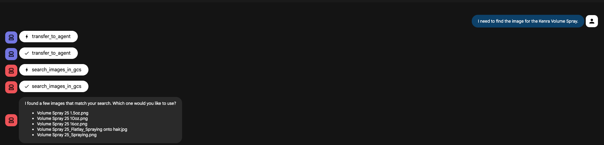
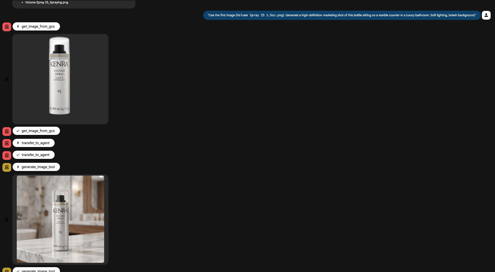

# Henkel Design Studio Multi-Agent System

The **Design Studio Agent** is a Multi-Agent System (MAS) built using Google's Agent Development Kit (ADK) and Gemini models. It acts as an AI-powered creative studio capable of generating marketing imagery, and performing high-fidelity image editing while preserving product integrity.

## 🏗 Architecture

The system consists of a **Root Agent** that orchestrates three specialized sub-agents:

1.  **Root Agent (`design_studio_agent`)**:
    *   **Role:** The interface layer. It analyzes user requests and routes them to the appropriate sub-agent.
    *   **Capabilities:** Context understanding, delegation, and error handling.

2.  **GCS Agent (`gcs_agent`)**:
    *   **Role:** The Asset Manager.
    *   **Capabilities:** 
        *   Fuzzy search for images in Google Cloud Storage.
        *   Retrieving specific images into the artifact store.
        *   Saving generated/edited results back to GCS.

3.  **Image Generation Agent (`image_gen_agent`)**:
    *   **Role:** The Creative Photographer.
    *   **Capabilities:** Generates new marketing shots using a reference product. It rewrites prompts to include professional lighting and style descriptors.

4.  **Image Edit Agent (`image_edit_agent`)**:
    *   **Role:** The Retoucher.
    *   **Capabilities:** Changes backgrounds/scenes of existing images *without* altering the product itself. Supports "Fast" (Speed) and "Capability" (Quality) modes.
---

## 🚀 Setup & Installation

### Prerequisites
*   Python 3.10+
*   Google Cloud Project with Vertex AI API enabled.
*   Google Cloud Storage Buckets (one for source images, one for output).

### Environment Variables
Create a `.env` file in the root directory:

```env
GOOGLE_CLOUD_PROJECT=your-project-id
GOOGLE_CLOUD_LOCATION=us-central1
# Bucket containing source product images
GCS_BUCKET_SKU_DATA=your-source-bucket-name
# Bucket to save generated images
GCS_BUCKET_OUTPUT=your-output-bucket-name
```

### Installation

```bash
# Clone repository
git clone <repo-url>
cd design_studio_agent

# Create virtual environment
python -m venv venv
source venv/bin/activate

# Install dependencies
uv sync --active 
```

## 💬 Agent Capabilities & Prompt Examples

The agent is designed to handle a full asset creation workflow. Below are examples of how to interact with it.

### 1. Sourcing Assets (GCS Agent)
*Before generating or editing, the agent usually needs a reference product.*

> **User:** "I need to find the image for the Kenra Volume Spray."

**Agent Action:**
* Delegates to `gcs_agent`.
* Executes `search_images_in_gcs("Kenra Volume Spray")`.
* Returns a list of matching filenames.

> **Agent Response:**
> "I found a few matches in the database:
> 1. `Volume Spray 25 1.5oz.png`
> 2. `Volume Spray 25 10oz.png`
> Which one would you like to use?"



### 2. Image Generation (Gen Agent)
*Creating a new scene from scratch using the sourced product.*

> **User:** "Use the first image (`Volume Spray 25 1.5oz.png`). Generate a high-definition marketing shot of this bottle sitting on a marble counter in a luxury bathroom. Soft lighting, bokeh background."

**Agent Action:**
* `root_agent` delegates to `gcs_agent` to load the file (if not already loaded).
* Delegates to `image_gen_agent`.
* Executes `generate_image_tool`.
* **Constraint:** Strictly preserves text and logo.
* **Creative:** Generates marble counter and bathroom context.

> **Agent Response:**
> *(Displays generated image)* 

> "Here is the generated image of the Volume Spray in a luxury bathroom setting. Would you like to save this or try a different angle?"

### 3. Background Editing (Edit Agent)
*Quickly swapping the background of an existing asset.*

> **User:** "Actually, can you just change the background to a solid studio grey? I need it for a catalog."

**Agent Action:**
* Delegates to `image_edit_agent`.
* Executes `change_background_fast_tool` (Optimized for speed).

> **Agent Response:**
> *(Displays edited image)*
> "I've updated the background to solid studio grey. How does this look?"

### 4. Saving & Publishing
*Finalizing the asset.*

> **User:** "That's perfect. Save it to the cloud."

**Agent Action:**
* Delegates to `gcs_agent`.
* Executes `save_image_to_gcs`.

> **Agent Response:**
> "I have saved the image as `generated_img_123.png`.
> You can download it here: **[Signed URL Link]** (Valid for 120 minutes)."

## 🛠 Deployment

### ADK Web (Local Host)
### Google Cloud Run Deployment